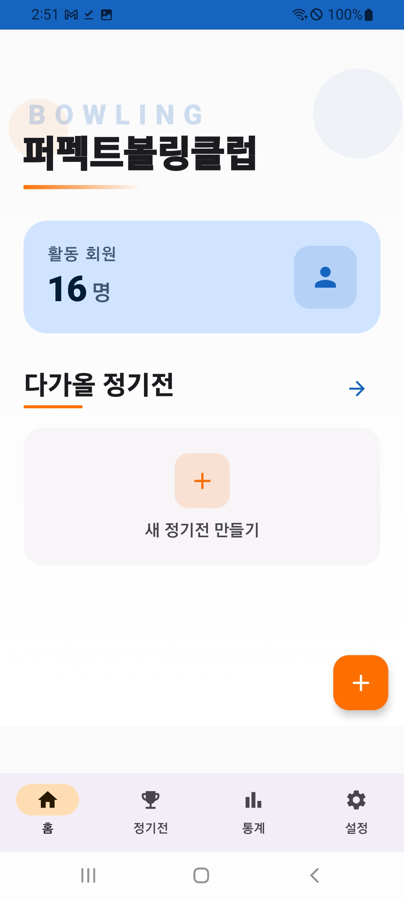
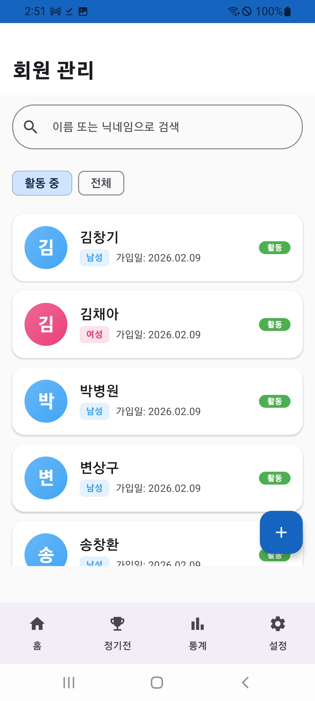
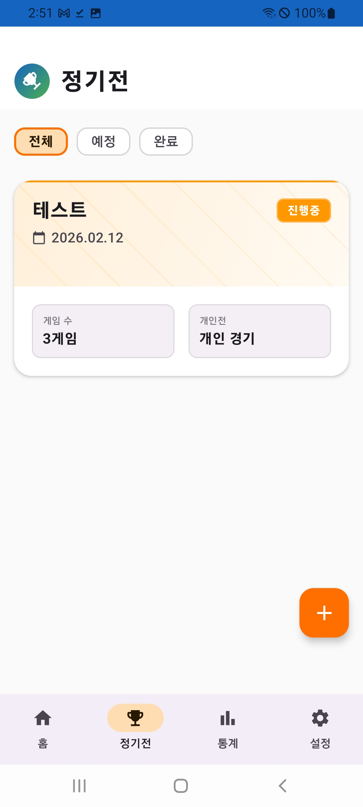
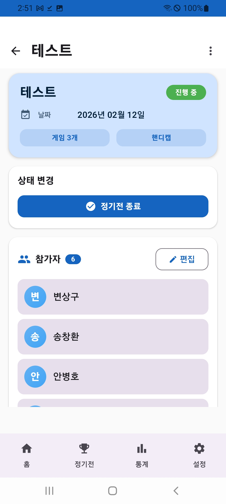
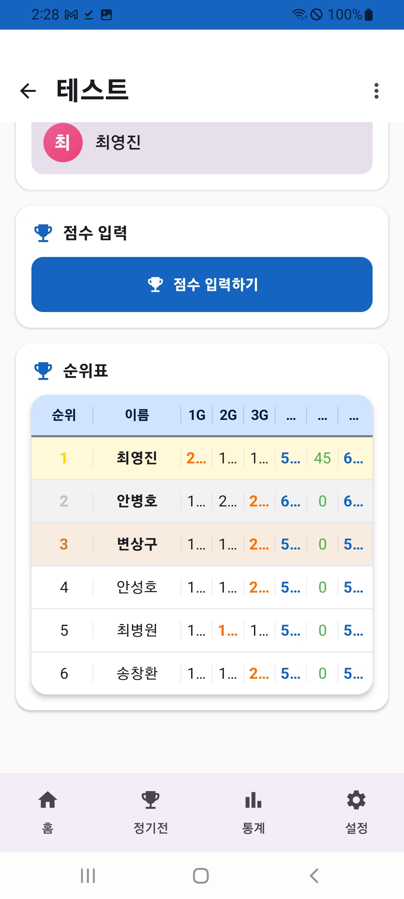
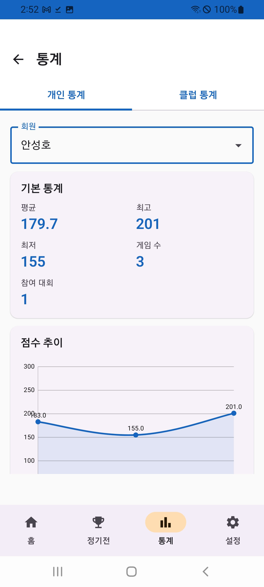
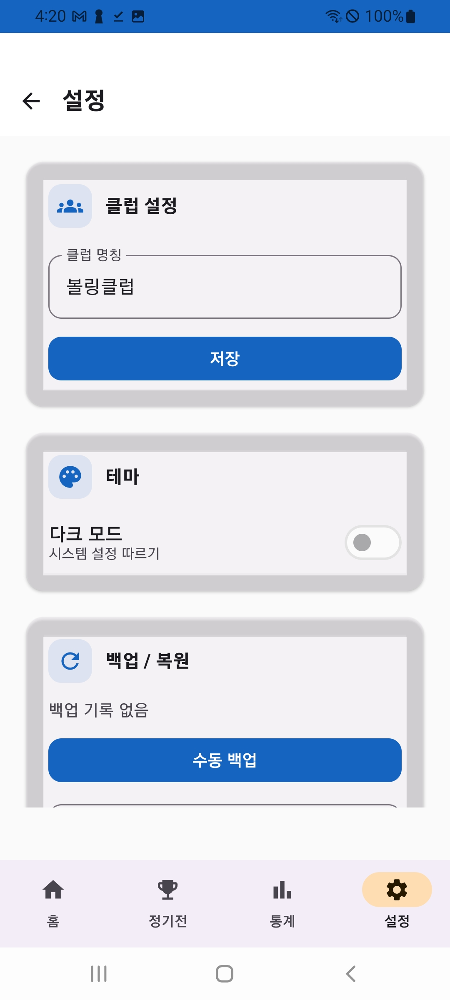

# 퍼펙트볼링클럽 - 사용 설명서

볼링 클럽의 회원 관리, 정기전 운영, 점수 기록 및 통계를 한 곳에서 관리할 수 있는 앱입니다.

---

## 목차

1. [홈 화면](#1-홈-화면)
2. [회원 관리](#2-회원-관리)
3. [정기전 목록](#3-정기전-목록)
4. [정기전 상세](#4-정기전-상세)
5. [점수 입력 및 순위표](#5-점수-입력-및-순위표)
6. [통계](#6-통계)
7. [설정](#7-설정)

---

## 1. 홈 화면

<p align="center">
  
</p>

앱을 실행하면 가장 먼저 보이는 화면입니다.

| 항목 | 설명 |
|------|------|
| **클럽 이름** | 상단에 클럽 명칭이 표시됩니다 (설정에서 변경 가능) |
| **활동 회원** | 현재 활동 중인 회원 수를 보여줍니다 |
| **다가올 정기전** | 예정된 정기전이 있으면 여기에 표시됩니다 |
| **새 정기전 만들기** | (+) 버튼을 눌러 새로운 정기전을 생성합니다 |

**하단 네비게이션 바**에서 홈, 정기전, 통계, 설정 탭으로 이동할 수 있습니다.

---

## 2. 회원 관리

<p align="center">
  
</p>

홈 화면에서 **활동 회원** 카드를 터치하면 회원 관리 화면으로 이동합니다.

### 주요 기능

- **검색**: 상단 검색창에서 이름 또는 닉네임으로 회원을 검색할 수 있습니다
- **필터**: "활동 중" / "전체" 탭으로 활동 회원만 보거나 전체 회원을 볼 수 있습니다
- **회원 추가**: 우측 하단 (+) 버튼을 눌러 새 회원을 등록합니다
- **회원 상세**: 회원 카드를 터치하면 상세 정보를 확인/수정할 수 있습니다

### 회원 카드 정보

각 회원 카드에는 다음 정보가 표시됩니다:
- 이름 (성 첫 글자 아바타)
- 성별 (남성: 파란색, 여성: 분홍색)
- 가입일
- 활동 상태 (활동/비활동)

---

## 3. 정기전 목록

<p align="center">
  
</p>

하단 네비게이션에서 **정기전** 탭을 선택하면 정기전 목록 화면이 나옵니다.

### 필터 탭

| 탭 | 설명 |
|-----|------|
| **전체** | 모든 정기전을 표시합니다 |
| **예정** | 아직 시작하지 않은 정기전입니다 |
| **완료** | 종료된 정기전입니다 |

### 정기전 카드 정보

- **대회명**: 정기전 이름
- **날짜**: 개최일
- **상태**: 진행중 / 예정 / 완료
- **게임 수**: 진행하는 게임 수 (예: 3게임)
- **유형**: 개인전 / 팀전

### 새 정기전 만들기

우측 하단 (+) 버튼을 눌러 새 정기전을 생성할 수 있습니다.

설정 항목:
1. 대회명 입력
2. 날짜 선택
3. 게임 수 설정
4. 개인전/팀전 선택
5. 참가 회원 선택

---

## 4. 정기전 상세

<p align="center">
  
</p>

정기전 목록에서 카드를 터치하면 상세 화면으로 이동합니다.

### 화면 구성

| 섹션 | 설명 |
|------|------|
| **대회 정보** | 대회명, 날짜, 게임 수, 핸디캡 적용 여부 |
| **상태 변경** | "정기전 종료" 버튼으로 대회를 완료 처리합니다 |
| **참가자** | 참가 회원 목록과 인원 수가 표시됩니다 |

### 참가자 관리

- **편집** 버튼을 눌러 참가자를 추가/제거할 수 있습니다
- 참가자 목록에서 회원을 터치하면 개별 점수를 확인할 수 있습니다

---

## 5. 점수 입력 및 순위표

<p align="center">
  
</p>

정기전 상세 화면을 아래로 스크롤하면 **점수 입력**과 **순위표** 섹션이 나옵니다.

### 점수 입력하기

1. "점수 입력하기" 버튼을 터치합니다
2. 참가자를 선택합니다
3. 각 게임별 점수를 입력합니다
4. 저장 버튼을 누릅니다

### 순위표 읽는 법

| 열 | 설명 |
|-----|------|
| **순위** | 최종 점수 기준 순위 (1위: 금색, 2위: 은색, 3위: 동색) |
| **이름** | 참가자 이름 |
| **1G, 2G, 3G** | 각 게임별 점수 |
| **합계** | 게임별 점수의 합계 |
| **핸디캡** | 적용된 핸디캡 점수 |
| **최종** | 합계 + 핸디캡 = 최종 점수 |

빨간색 숫자는 해당 게임에서 가장 높은 점수(하이게임)를 의미합니다.

---

## 6. 통계

<p align="center">
  
</p>

하단 네비게이션에서 **통계** 탭을 선택하면 통계 화면이 나옵니다.

### 개인 통계

상단 드롭다운에서 **회원을 선택**하면 해당 회원의 통계가 표시됩니다.

| 항목 | 설명 |
|------|------|
| **평균** | 전체 게임 평균 점수 |
| **최고** | 가장 높은 점수 (하이게임) |
| **최저** | 가장 낮은 점수 |
| **게임 수** | 총 기록된 게임 수 |
| **참여 대회** | 참여한 정기전 수 |

### 점수 추이 그래프

하단에 **꺾은선 그래프**로 게임별 점수 변화를 시각적으로 확인할 수 있습니다. 점수의 상승/하락 추세를 한눈에 파악할 수 있습니다.

### 클럽 통계

상단의 "클럽 통계" 탭을 선택하면 클럽 전체의 통합 통계를 볼 수 있습니다.

---

## 7. 설정

<p align="center">
  
</p>

하단 네비게이션에서 **설정** 탭을 선택합니다.

### 클럽 설정

- **클럽 명칭**: 클럽 이름을 입력하고 "저장" 버튼을 누릅니다
- 홈 화면에 표시되는 클럽 이름이 변경됩니다

### 테마

- **다크 모드**: 토글 스위치로 다크 모드를 켜고 끌 수 있습니다
- "시스템 설정 따르기"가 기본값입니다

### 백업 / 복원

| 기능 | 설명 |
|------|------|
| **수동 백업** | 현재 데이터를 JSON 파일로 백업합니다 |
| **백업 공유** | 백업 파일을 카카오톡, 이메일 등으로 공유합니다 |
| **복원하기** | JSON 백업 파일에서 데이터를 복원합니다 |
| **점수 CSV 내보내기** | 모든 점수 데이터를 엑셀 호환 CSV 파일로 내보냅니다 |
| **회원 CSV 내보내기** | 회원 목록을 CSV 파일로 내보냅니다 |
| **회원 CSV 가져오기** | CSV 파일에서 회원 데이터를 일괄 등록합니다 |

### 자동 백업

- 토글 스위치로 자동 백업을 활성화할 수 있습니다
- 활성화하면 주기적으로 자동 백업이 실행됩니다

### PIN 잠금

- 앱 접근 시 PIN 번호 인증을 요구하도록 설정할 수 있습니다

---

## 회원 CSV 가져오기 형식

CSV 파일로 회원을 일괄 등록할 때 다음 형식을 사용합니다:

```
이름,닉네임,성별,연락처,활동상태,가입일
홍길동,,M,010-1234-5678,활동중,2026-01-01
김볼링,볼링왕,F,010-9876-5432,활동중,2026-02-01
```

| 열 | 필수 | 설명 |
|----|------|------|
| 이름 | O | 회원 이름 |
| 닉네임 | X | 별명 (비워도 됨) |
| 성별 | X | M(남성) 또는 F/여(여성), 기본값: M |
| 연락처 | X | 전화번호 |
| 활동상태 | X | "활동중" 또는 "비활동", 기본값: 활동중 |
| 가입일 | X | YYYY-MM-DD 형식, 기본값: 오늘 날짜 |

---

## 앱 정보

- **앱 이름**: 퍼펙트볼링클럽
- **버전**: 1.1.0
- **플랫폼**: Android
- **최소 요구사항**: Android 8.0 이상
